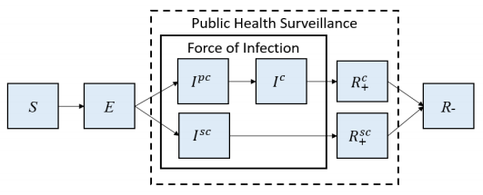

本应用使用的方法为 ["A Modelling Study for Designing a Multi-layered Surveillance Approach to Detect the Potential
Resurgence of SARS-CoV-2"](https://www.medrxiv.org/content/10.1101/2020.06.27.20141440v1.full.pdf) 中方法的简化版。所使用的动力学模型框架如下图（类SEIR）。输入参数中，唯有行政区划编码（年龄结构）和即时再生数会对此动力学模型产生直接的影响。具体人群分类及模型结果见“暴发历史”。  
  
This application is based on a simplied version of the method described in the manuscript titled ["A Modelling Study for Designing a Multi-layered Surveillance Approach to Detect the Potential
Resurgence of SARS-CoV-2"](https://www.medrxiv.org/content/10.1101/2020.06.27.20141440v1.full.pdf). The (SEIR-type) theoretical framework is shown below.  Among the input parameters, only prefecture code (age distribution) and instantaneous reproduction number will directly affect the model. The specific definitions of each compartment and model results can be found in the "outbreak history" tab.       
  
  
     

  
------ 

此模型考虑到了：  
1. 不同地区人口年龄结构差异和中国国内人口接触程度；  
2. 无症感染者和未发病感染者；  
3. 患者在失去感染性之后仍然保持核酸阳性的可能性；  
4. 有症状的患者与无证患者核酸检测敏感性差异。  
  
This model considers:  
1. Age structure by prefecture and contact patterns in mainland China;  
2. Asymptomatic and pre-symptomatic infections;  
3. Poissibilities that an infected individuals may remain PCR positive after losing infectivity;  
4. PCR sensitivity differences for infected individuals with and without symptoms.  
  
------ 

其中隐含假设包括：  
1. COVID-19再暴发由1名输入性病例造成；  
2. 无症感染者的比率较高（高于50%）；  
3. 无症感染者和未发病感染者比现有症状的患者传染性低；  
4. 儿童易感性低于成人；  
5. 在已感染的情况下，儿童更容易成为无症感染者；  
6. 医疗资源水平以北京为例（例如：每日每千人呼吸科服务人数上限）；  
7. 普通人群中绝大多数人易感。  
  
Assumptions include:  
1. Sporadic outbreaks are caused by one imported cases;  
2. There's a non-trivial proportion of asymptomatic infection (>50%);  
3. Asymptomatic and pre-symptomatic individuals are less infectious compared to currently infectious individuals;  
4. Children are less susceptible compared to adults;  
5. Children are more likely to progress subclinically after getting infected;  
6. Healthcare access level (e.g., patients/1000 population/day seen at respiratory departments);  
7. The general population is susceptible to COVID-19.  
  
------ 

  
所需参数详细介绍如下： 
- 行政区划编码（北京 = 110100）；   
- 即时再生数（最小值 = 1； 最大值 = 5； 步宽 = 0.5）；  
- 符合发热症状患者占总人口比（根据流感门诊ILI症状占比，预设值为0.03，即普通人口的3%有类流感症状。此值在北半球冬季会接近6%，而在北半球夏季会接近2%）；      
- 发热门诊日接诊率（每千人）（由北京市发热门诊接诊量估算，预设为0.07/1000）；  
- 发热门诊日检测率（最小值=0；最大值=1；预设为50%，即50%发热门诊患者将接受核酸检测）；  
- 呼吸道疾病患者占总人口比（最小值 = 0；最大值=1；根据全球疾病负担推算，预设为10%，即普通人口的10%有急性或慢性呼吸道疾病）；  
- 呼吸科日接诊率（每千人）（由北京市顺义区呼吸科接诊量估算，预设为1.35/1000）；
- 呼吸科日检测率（最小值 = 0；最大值 = 1； 预设为0.1，即10%呼吸科患者将接受核酸检测）；
- 普通人群日检测率（最小值 = 0；最大值=0.1,；预设为0）；  
- 有症状人群核酸敏感性（最小值 = 0； 最大值 = 1， 根据目前文献预设为0.7）；  
- 无症状人群核酸敏感性（最小值 = 0； 最大值 = 1， 根据目前文献预设为0.5）。
  
Parameters include:  
- Prefecture code (e.g., Beijing = 110100): This is a six digit code used in China where the first 2 digits indicate province, the third and fourth digits indicate prefecture, and the fifth and sixth digits indicate county/ district. In the context of this application, the fifth and sixth digits are zero - showing that these are prefecture level units.    
- Instantaneous reproduction number (min = 1; max = 5, step = 0.5).  
- Baseline population at fever clinic: the percentage of the total population with influenza-like illness in China. Default value is 3% - based on influenza surveillance, roughly 3% of the population in the district under consideration display influenza-like symptoms. This value is higher in winter (~6%) and lower in summer (~2%).  
- Fever clinic service capacity (per 1000 residents): the number of patients seen each day at fever clinics relative to the population size. Based on Beijing's fever clinic fever capacity, the default value is set to 0.07/1000.    
- Fever clinic daily testing proportion (0-1): the proportion of fever clinic patients receiving a COVID-19 PCR test each day. Default value is set to 0.5.  
- Baseline population at the respiratory department: the percentage of the total population with respiratory illness in China. Default value is at 10% based on Global Burden of Disease.  
- Respiratory departments service capacity (per 1000 residents): the number of parients seen each day at respiratory departments relative to the population size. Based on Beijing Shunyi's respiratory department capacity, the default value is set to 1.35/1000.  
- Respiratory department daily testing proportion: the proportion of respiratory department patients receiving a COVID-19 PCR test each day. Default value is set to 0.1.  
- General population daily testing proportion (0-0.01): the proportion of the general population receiving COVID-19 PCR tests each day. Since the population size is expected to be high, this proportion is expected to be low.  
- PCR sensitivity among symptomatic individuals: default value set to 0.7 based on existing literature.
- PCR sensitivity among individuals without symptoms: default value set to 0.5 based on existing literature.
  
------ 

作者: 刘扬 Yang Liu PhD ([yang.liu@lshtm.ac.uk](mailto:yang.liu@lshtm.ac.uk), [yangliubeijing](https://twitter.com/yangliubeijing))  
参与制作：杜珩 Heng Du PhD，龚文峰 Wenfeng Gong PhD，牛艳 Yan Niu PhD
